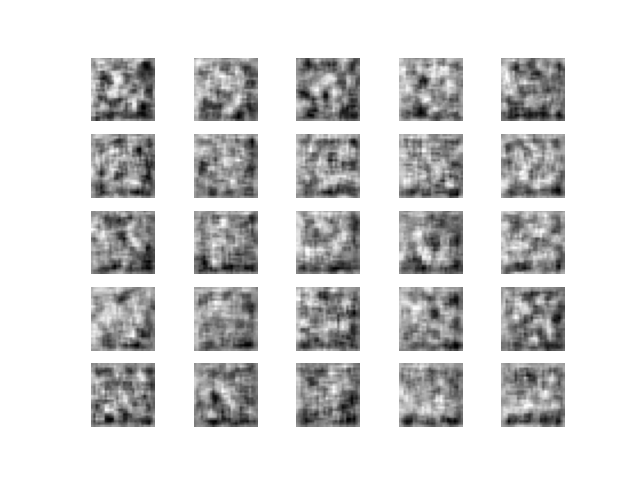
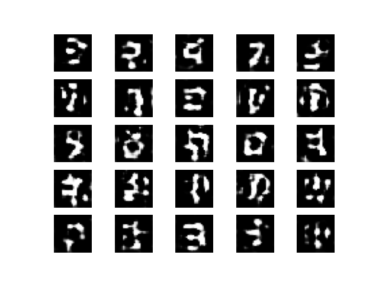
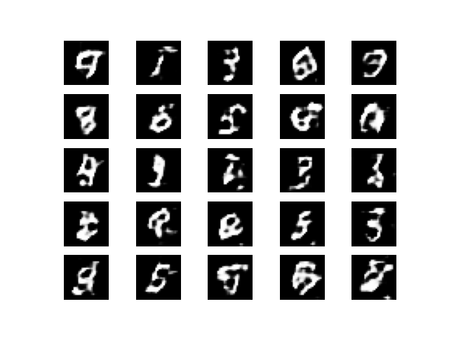
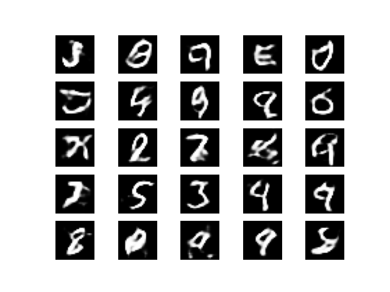
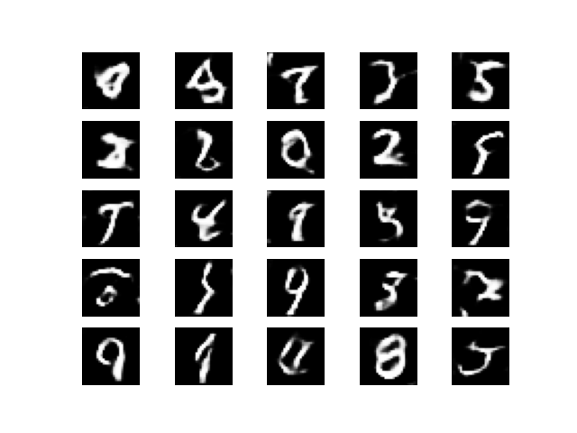
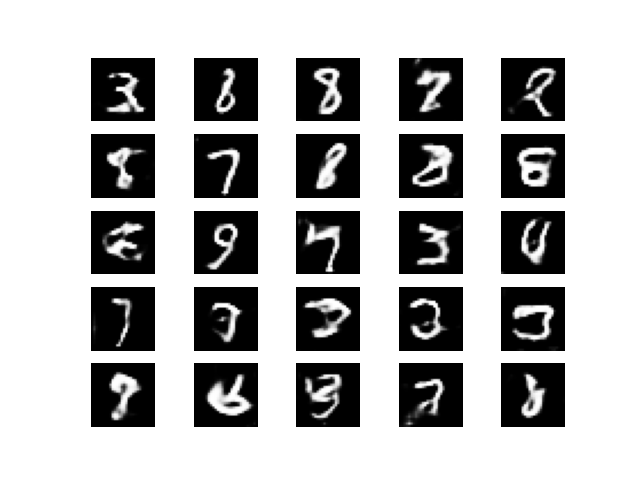

# DCGAN 손글씨 숫자 생성 / Handwritten Digit Generation with a DCGAN

> **English summary.** A Deep Convolutional GAN (DCGAN) built from scratch in TensorFlow/Keras that learns to generate MNIST-style handwritten digits from 100-dimensional Gaussian noise. The generator upsamples noise to 28×28 images with `BatchNormalization` + `LeakyReLU` + `tanh`; the convolutional discriminator is trained adversarially against it. Snapshots saved every 200 epochs make the learning progression directly visible — from pure noise to recognizable digits over 4,000 epochs.


---

## 개요

생성적 적대 신경망(GAN)의 핵심 아이디어인 **생성자 vs 판별자의 적대적 학습**을 직접 구현한 프로젝트입니다. 100차원 랜덤 노이즈 벡터로부터 시작해, 판별자를 속일 수 있을 만큼 사실적인 28×28 손글씨 숫자 이미지를 생성하도록 생성자를 학습시킵니다. 학습 구간(200 epoch)마다 생성 이미지를 저장해 **모델이 노이즈에서 숫자로 수렴해 가는 과정**을 눈으로 확인할 수 있습니다.

## 모델 구조 (DCGAN)

**생성자 (Generator)** — 노이즈 → 이미지
```
Input(100) → Dense(7·7·128) → BatchNorm → LeakyReLU(0.2) → Reshape(7,7,128)
  → UpSampling2D → Conv2D(64, 5x5) → BatchNorm → LeakyReLU(0.2)
  → UpSampling2D → Conv2D(1, 5x5, activation='tanh')   # 출력 28×28×1
```

**판별자 (Discriminator)** — 이미지 → 진짜/가짜 확률
```
Input(28,28,1) → Conv2D(64, 5x5, stride2) → LeakyReLU(0.2)
  → Conv2D(128, 5x5, stride2) → LeakyReLU(0.2) → Flatten → Dense(1, sigmoid)
```

**적대적 결합(GAN)** — 판별자를 동결(`trainable=False`)한 뒤 `Generator → Discriminator`를 연결해, 생성자가 "진짜(1)"로 판별되도록 갱신.

| 항목 | 값 |
|------|-----|
| 입력 노이즈 | 100차원 표준정규분포 `N(0,1)` |
| 활성화 | LeakyReLU(0.2), 출력 tanh |
| 정규화 | 입력 `(x-127.5)/127.5` → `[-1,1]`, BatchNormalization |
| 손실 / 최적화 | Binary Crossentropy / Adam |
| epoch / batch / 저장주기 | 4001 / 32 / 200 |

> 설계 노트: LeakyReLU와 tanh 조합은 DCGAN에서 경험적으로 안정적인 수렴을 보여 채택했습니다. 판별자 손실은 실제/가짜 배치 손실의 평균으로 계산합니다.

## 결과 — 학습 진행에 따른 생성 이미지

각 이미지는 동일 시점에 생성자가 만든 25장(5×5)의 샘플입니다.

| Epoch 0 | Epoch 200 | Epoch 1000 |
|:---:|:---:|:---:|
|  |  |  |
| **Epoch 2000** | **Epoch 3000** | **Epoch 4000** |
|  |  |  |

초기(epoch 0)에는 무의미한 노이즈였다가, 학습이 진행될수록 획의 구조가 잡히고 후반부에는 사람이 읽을 수 있는 숫자 형태로 수렴합니다. 학습 종료 시 판별자/생성자 손실 곡선을 함께 출력합니다.

## 실행 방법

```bash
pip install -r requirements.txt
# 스크립트와 같은 위치에 gan_images/ 폴더가 있어야 스냅샷이 저장됩니다.
mkdir -p gan_images
python "src/1.GAN_generator_생성.py"
```
MNIST는 `tensorflow.keras.datasets`에서 자동 다운로드됩니다. GPU 사용을 권장합니다(4001 epoch).

## 배운 점

- 생성자와 판별자가 **번갈아 갱신**되며 서로를 견제하는 미니맥스 학습 구조를 코드로 체득.
- 판별자 동결 → GAN 결합 모델로 생성자만 학습시키는 **그래프 구성 트릭**의 필요성 이해.
- 입력 정규화(`[-1,1]`)와 출력 `tanh`, BatchNorm이 GAN 안정화에 미치는 영향을 실험적으로 확인.

## 참고

- 관련 저장소: [deep-learning-keras](https://github.com/NvidiaSeoul/deep-learning-keras) · [computer-vision](https://github.com/NvidiaSeoul/computer-vision)
- Radford et al., *Unsupervised Representation Learning with Deep Convolutional GANs (DCGAN)*, 2015

---
> NVIDIA AI Academy Seoul · Cohort 1 포트폴리오의 일부 — [전체 보기](https://github.com/NvidiaSeoul)
